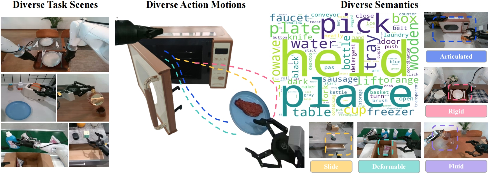

# EWMBench: Evaluating Scene, Motion, and Semantic Quality in Embodied World Models

<div id="top" align="center">




 <a href='https://arxiv.org/abs/2505.09694'></a> &nbsp; <a href='https://huggingface.co/agibot-world/EWMBench-model'></a> &nbsp; <a href=' https://huggingface.co/datasets/agibot-world/EWMBench
'></a> &nbsp;


</div>

**Embodied World Model Benchmark (EWMBM)** is a benchmark framework specifically designed to evaluate **Embodied World Models (EWMs)**, aiming to assess the performance of text-driven video generation models in embodied tasks. EWMBM systematically evaluates the **physical plausibility** and **task coherence** of generated content across three key dimensions: **visual scene consistency**, **motion correctness**, and **semantic alignment**. Compared to traditional perceptual metrics, EWMBM focuses more on the **practical usability** and **rationality** of generation results within embodied contexts. It is accompanied by a **multi-dimensional evaluation toolkit** and a **high-quality, diverse dataset**, providing insights into the limitations of current methods and driving progress toward the next generation of embodied intelligence models.


## Getting started


### Setup

* CUDA Version: 11.8
* Python 3.10+ recommended
* Use `conda` or `virtualenv` for environment isolation

```
conda create -n EWMBench python=3.10.16
conda activate EWMBench
git clone --recursive https://github.com/AgibotTech/EWMBench
cd EWMBench
pip install -r requirements.txt
pip install git+https://github.com/openai/CLIP.git

```

---

### Pre_trained Weights

1. Download the official Qwen2.5 checkpoint from [Qwen2.5](https://huggingface.co/Qwen/Qwen2.5-VL-7B-Instruct) , and the tool of Qwen2.5 come from [Qwen2.5-tool](https://github.com/QwenLM/Qwen2.5-VL/tree/main/qwen-vl-utils) and modify to adapt our algorithm.

2. Download the [clip-vit-base-patch16](https://huggingface.co/openai/clip-vit-base-patch16) weight and [CLIP-vit-b-32](https://openaipublic.azureedge.net/clip/models/40d365715913c9da98579312b702a82c18be219cc2a73407c4526f58eba950af/ViT-B-32.pt) weight.

3. Download [the our finetuned DINOv2 and YOLO-World](https://huggingface.co/agibot-world/EWMBench-model) weights.


**We need to add the path of each weight to config.yaml.**


---


### Data Preparation
1. Download the dataset from [hugging face](https://huggingface.co/datasets/agibot-world/EWMBench)
2. Move the download dataset to ./data

Our ground truth data is stored in the `gt_dataset` folder. This folder contains the standard datasets used to verify model accuracy.

At the same time, we also provide test samples, which are located in the `test_dataset` folder. You can use these samples to test the performance of your algorithms or models.

- **Ground Truth Dataset Path**: `gt_dataset`
- **Test Sample Path**: `test_dataset`

We have provided official ground-truth and test datasets as described above. Please make sure to reference the files in these paths correctly to ensure smooth model training and evaluation.

In addition to the official datasets, you may also use your own data. However, it is important to follow the required directory structure outlined below to ensure compatibility.

- **Ground Truth Data** 

```
gt_dataset/
├── task_1/
│   ├── episode_1/
│   │   ├── prompt/
│   │   │   ├── init_frame.png
│   │   │   └── introduction.txt
│   │   └── video/
│   │       ├── frame_00000.jpg
│   │       ├── ...
│   │       └── frame_0000n.jpg
│   ├── episode_2/
│   └── ...
├── task_2/
└── ...
```

- **Generated Samples**

```
generated_samples/
├── task_1/
│   ├── episode_1/
│   │   ├── 1/
│   │   │   └── video/
│   │   │       ├── frame_00000.jpg
│   │   │       ├── ...
│   │   │       └── frame_0000n.jpg
│   │   ├── 2/
│   │   └── 3/
│   ├── episode_2/
│   └── ...
├── task_2/
└── ...
```

### Data Preprocessing 

To preprocess the inference data, use the following command:

```
cd /path/to/ewmbm
bash ./EWMBench/processing.sh ./ewmbm/config.yaml
```

Note: Ground truth detection must be performed on first run.

**After processing, please check the data directory structure**

> ⚠️ If your data structure does not match the following format, it does not meet the benchmark requirements.

- **Ground Truth Data** 

```
gt_dataset/
├── task_1/
│   ├── episode_1/
│   │   ├── gripper_detection/
│   │   │   └── video.mp4
│   │   ├── prompt/
│   │   │   ├── init_frame.png
│   │   │   └── introduction.txt
│   │   ├── traj/
│   │   │   └── traj.npy
│   │   └── video/
│   │       ├── frame_00000.jpg
│   │       ├── ...
│   │       └── frame_0000n.jpg
│   ├── episode_2/
│   └── ...
├── task_2/
└── ...
```

- **Generated Samples**

```
generated_samples/
├── task_1/
│   ├── episode_1/
│   │   ├── 1/
│   │   │   ├── gripper_detection/
│   │   │   │   └── video.mp4
│   │   │   ├── traj/
│   │   │   │   └── traj.npy
│   │   │   └── video/
│   │   │       ├── frame_00000.jpg
│   │   │       ├── ...
│   │   │       └── frame_0000n.jpg
│   │   ├── 2/
│   │   └── 3/
│   ├── episode_2/
│   └── ...
├── task_2/
└── ...
```

---


## Running Evaluation

1. Modify the configuration file:

```
# modify config.yaml
```


2. To run evaluation tasks:

```
cd /path/to/ewmbm
python /path/to/ewmbm/evaluate.py --dimension 'semantics' 'trajectory_consistency' --config ./config.yaml
```

Available dimensions include:

* `diversity`
* `scene_consistency`
* `trajectory_consistency`
* `semantics`

---

Your results save as .csv file.


## Citation

Please consider citing our paper if our codes are useful:
```bib
@article{hu2025ewmbench,
  title={EWMBench: Evaluating Scene, Motion, and Semantic Quality in Embodied World Models},
  author={Hu, Yue and Huang, Siyuan and Liao, Yue and Chen, Shengcong and Zhou, Pengfei and Chen, Liliang and Yao, Maoqing and Ren, Guanghui},
  journal={arXiv preprint arXiv:2505.09694},
  year={2025}
}
```


## License

All the data and code within this repo are under [CC BY-NC-SA 4.0](https://creativecommons.org/licenses/by-nc-sa/4.0/).
